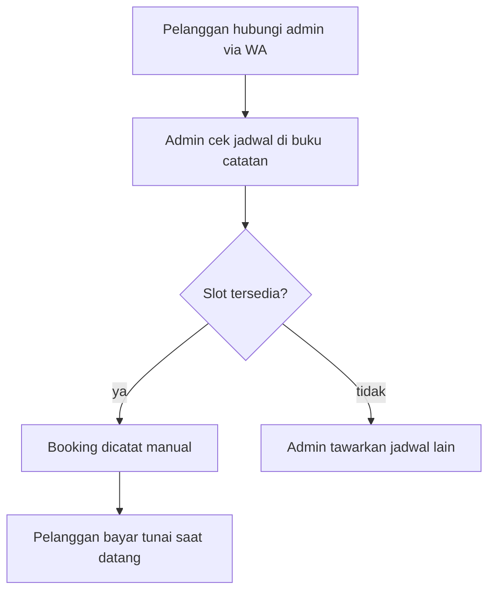
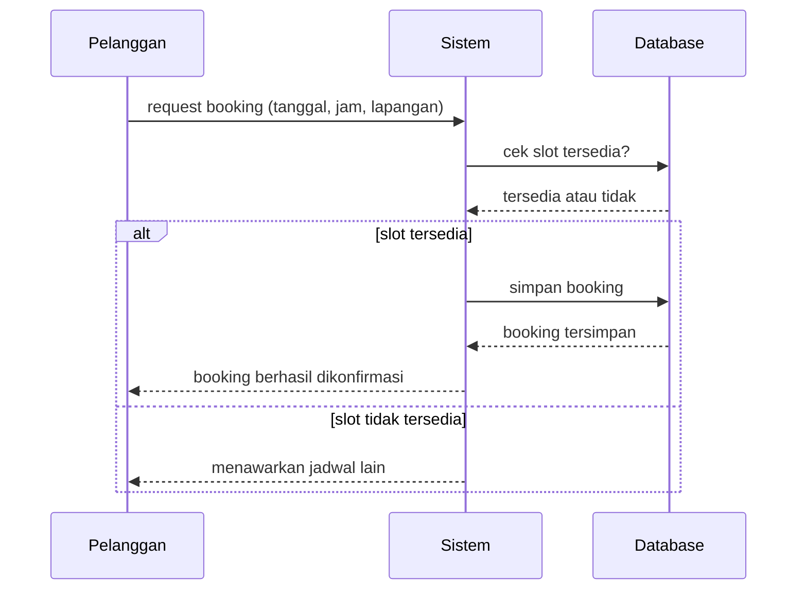

# Sistem Reservasi Lapangan Olahraga

Aplikasi backend untuk booking lapangan olahraga (futsal/badminton), menggantikan proses booking manual via WhatsApp/telepon. Dibuat dengan proses system analysis lengkap sebelum coding.

## Tech Stack
- Node.js + Express
- MySQL (mysql2)
- JWT untuk autentikasi
- bcrypt untuk hashing password
- Multer untuk upload file

## 1. Analisis Sistem yang Sedang Berjalan (Manual)

Pelanggan menghubungi admin lewat WA/telepon untuk menanyakan jadwal kosong. Admin mengecek buku catatan manual, mencatat booking secara manual jika tersedia, lalu pelanggan membayar tunai saat datang. Proses ini rawan double booking karena tidak ada validasi otomatis.

## 2. Sequence Diagram — Booking (Sistem Baru)

## 3. Struktur Database

- **users**: id, nama_users, telepon, email, password, role (pelanggan/admin)
- **lapangan**: id, nama_lapangan, harga_per_jam
- **bookings**: id, user_id, lapangan_id, jadwal_mulai, jadwal_selesai, status_booking
- **pembayaran**: id, booking_id, bukti_pembayaran, status_pembayaran, diverifikasi_oleh, tanggal_upload, tanggal_verifikasi

## API Endpoints

| Method | Endpoint | Akses | Keterangan |
|--------|----------|-------|------------|
| POST | /api/auth/register | Public | Registrasi akun pelanggan |
| POST | /api/auth/login | Public | Login, mengembalikan JWT token |
| GET | /api/lapangan | Login (semua role) | Lihat semua lapangan |
| GET | /api/lapangan/:id | Login (semua role) | Detail satu lapangan |
| POST | /api/lapangan | Admin | Tambah lapangan baru |
| PUT | /api/lapangan/:id | Admin | Ubah data lapangan |
| DELETE | /api/lapangan/:id | Admin | Hapus lapangan |
| POST | /api/booking | Login (pelanggan) | Buat booking, otomatis cek bentrok jadwal |
| GET | /api/booking/saya | Login (pelanggan) | Riwayat booking milik sendiri |
| POST | /api/pembayaran | Login (pelanggan) | Upload bukti pembayaran (form-data) |
| PUT | /api/pembayaran/:id/verifikasi | Admin | Verifikasi/tolak pembayaran |

## Cara Menjalankan

1. Clone repo ini
2. Masuk ke folder `lapangan_backend`, jalankan `npm install`
3. Buat file `.env` (lihat `.env.example`), sesuaikan konfigurasi database
4. Import struktur database dari file schema SQL (lihat folder `database/`)
5. Jalankan `npm start`
6. Untuk frontend testing, buka `lapangan_frontend/index.html` lewat Live Server